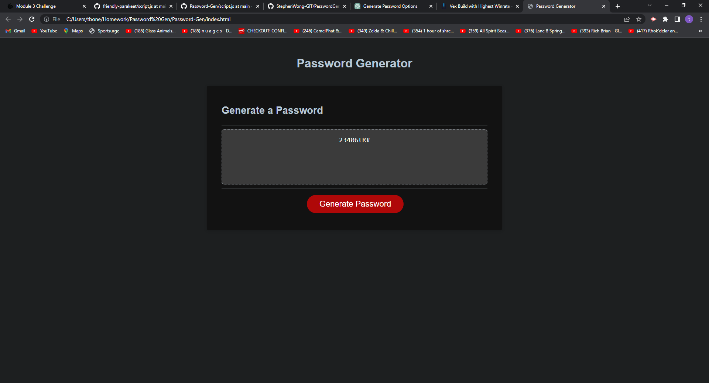

# Password-Gen

## Description
Click the "Generate Password" button on the page.
When prompted, enter the length of the password (between 8 and 128 characters).
When prompted, select which character types to include in the password (lowercase, uppercase, numeric, and/or special characters).
Once all prompts are answered, a password will be generated that matches the selected criteria.
The generated password will be displayed in the "Password" field on the page

## Installation
In order to get the development enviorment running you will need to clone the repository from my git hub[link]

## Usage

    

## Credits

List your collaborators, if any, with links to their GitHub profiles.

If you used any third-party assets that require attribution, list the creators with links to their primary web presence in this section.

If you followed tutorials, include links to those here as well.

## License